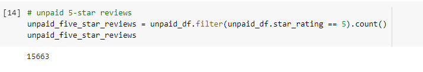

# Amazon_Vine_Analysis

## Overview
This project is set up to determine if there is a bias towards favorable reviews within the Amazon Vine service members. This analysis uses PySpark and Google Collabatory to connect to the Amazon RDS service and uses PGAdmin to perform an ETL to determine if there is a bias or not

## Results

* Total Vine reviews versus non-Vine

* Vine 5 star reveiws versus non-Vine

* Percentage of positive reviews that are Vine versus non-Vine

## Summary
Based on the results of the analysis there does appear to be a positivity bias for reviews from the Vine program. The results were 51% of the reviews were 5 stars from the Vine program versus 39% for non-Vine. I would like to see a ratio of the reviews and a comparison of the reviews as a way to scale the disparity of the reviews. Hopefully, this would give us a clearer picture and confirm this inital analysis.
